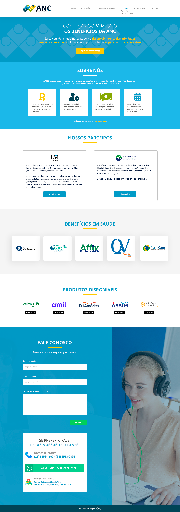

# <p align="center">Anc - Associação Nacional dos Comerciários 📱👷🏻‍♂️ </p>


---
## <p align="center">Acesso Rápido:</p>
<p align="center">https://gabiqrm.github.io/Anc/</p>


---
<p align="center">
   
</p>

<div align="center">

[](https://github.com/gabiqrm/Anc)<space> <space>[](https://github.com/gabiqrm/Anc/blob/master/LICENSE)<space> <space>[](https://github.com/gabiqrm/Anc/)

</div>

---
## 📋 Sobre:

Site criado a partir de um desafio proposto pela empresa Marlin, cujo o objetivo é gerar uma Landing Page, onde é necessário transformar o layout enviado em código HTML/CSS responsivo.

---
## ⚙️ Tecnologias:

```bash
📍 HTML5
📍 CSS3
📍 JavaScript
```

---
##  Execução:
1. Clonar via prompt de comando o projeto em uma pasta de sua preferência:
```bash
$ git clone https://github.com/gabiqrm/Anc.git
```
2. Acessar a pasta principal do projeto via prompt de comando:
```bash
$ cd Anc
```
3. Na pasta raiz, executar o arquivo: `index.html`

---
## 🔐 Licença:
Esse projeto está sob a licença MIT. Veja o arquivo [LICENSE](LICENSE) para mais detalhes.

---

## 👩🏻‍💻 Desenvolvedora:

Desenvolvido por Gabriela Queiroz ! 💜
